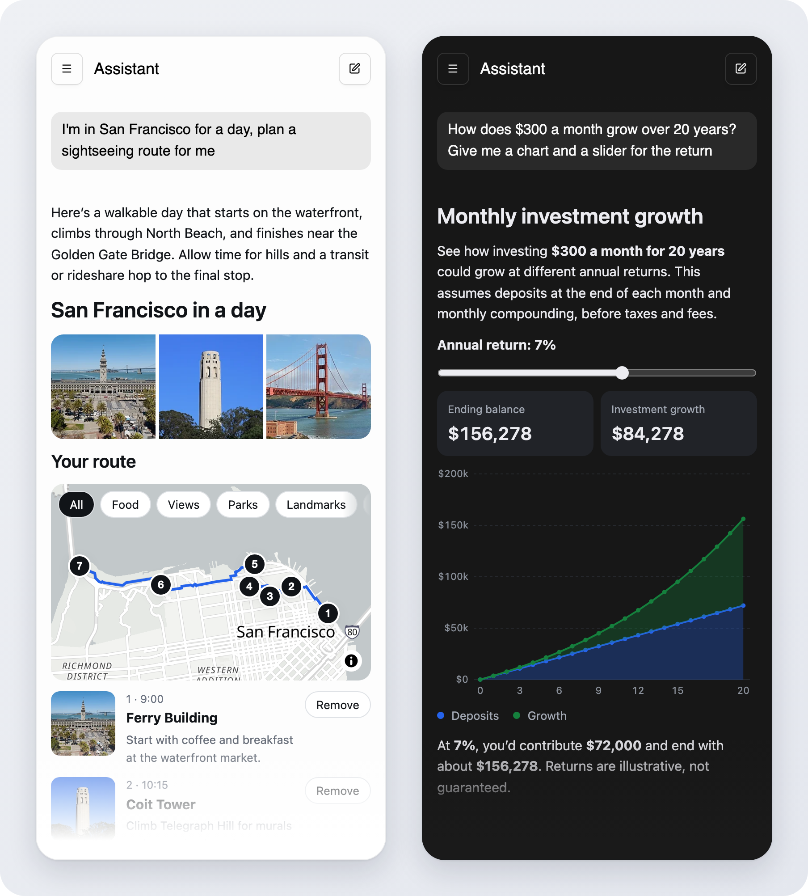

# Open Intelligent UI

Render model-written interfaces safely while they stream. The model answers with Markdown mixed with JSX-like tags and small JavaScript statements. This repo compiles that text as the stream grows, runs it in a locked-down sandbox, and renders the result with React components you define with zod schemas. The same component definitions generate the system prompt that teaches the model the language and your components.

It works with any model that streams chat completions. The answers below were written by a model and rendered by the example chat app while they streamed.

<p align="center">
  
</p>

```tsx
import {
  builtinComponents,
  callback,
  createLibrary,
  defineComponent,
  Renderer,
} from "@open-intelligent-ui/react";
import { z } from "zod/v4";

const Rating = defineComponent({
  name: "rating",
  description: "Star rating the user can change.",
  props: z.object({
    value: z.number(),
    max: z.number().default(5),
    onChange: callback({ params: "value: number" }),
  }),
  component: ({ props }) => (
    <div>
      {Array.from({ length: props.max }, (_, i) => (
        <button key={i} type="button" onClick={() => props.onChange(i + 1)}>
          {i < props.value ? "★" : "☆"}
        </button>
      ))}
    </div>
  ),
});

export const library = createLibrary({ components: [...builtinComponents, Rating] });

// On the server: the system prompt, generated from the schemas.
const systemPrompt = library.prompt({ additionalRules: ["Use rating to ask for a score."] });

// In the page: render the streamed answer. The page also imports "@open-intelligent-ui/react/styles.css".
<Renderer library={library} response={answer} isStreaming={streaming} />;
```

`chatCompletionTextStream(response)` turns a chat-completions SSE stream into text deltas to append to `answer`.

A response looks like this:

```
Here are this month's fixed costs.

{@body const [extra, setExtra] = useState(0)}
<box border radius="2xl" padding={4} gap={3}>
  {#each costs as cost}
    <row key={cost.name} justify="between"><text>{cost.name}</text><text tabularNums>{"$" + cost.amount}</text></row>
  {/each}
  <slider min={0} max={500} value={extra} onChange={setExtra}/>
  <text>Total: {"$" + (total + extra)}</text>
</box>
{@body const costs = [
{name: "Rent", amount: 1600},
{name: "Phone", amount: 45},
]}
{@body const total = costs.reduce((sum, c) => sum + c.amount, 0)}
```

Programs call hooks as plain functions (`useState`, `useMemo`, `useCallback`, `useEffect`, `useRef`, `useId`, `useNow`, `useTimeout`, `useAppData`) and ask the app to act with `action(name, ...args)`. The generated prompt teaches the common hooks, plus `useAppData` and `action` when you pass `appData` or `actions`.

## Packages

The packages are not on npm yet. Build them from source (see Development).

| Package                                        | What it does                                                                                                                                                             |
| ---------------------------------------------- | ------------------------------------------------------------------------------------------------------------------------------------------------------------------------ |
| [`@open-intelligent-ui/core`](packages/core)   | The compiler (also at `@open-intelligent-ui/core/compiler`, for servers), the sandboxed runtime, and framework-agnostic component libraries: prompts and prop validation |
| [`@open-intelligent-ui/react`](packages/react) | `Renderer`, the React flavor of `defineComponent` and `createLibrary`, the built-in components, and the bridge to OpenUI's chat interface                                |

## How it works

```
 model output (streaming text)
        │
        ▼
 compiler, in the page, as the stream grows
   keeps finished statements, drops a half-written one,
   closes open tags, wraps each expression so one failure stays local
        │  program + constants
        ▼
 ┌─ hidden iframe: sandbox="allow-scripts", CSP with no network ───┐
 │  Web Worker with network, timers and eval removed               │
 │  engine: run program → element tree → diff → operations         │
 │  state: { extra: 0 }   handlers stay here, the page gets slots  │
 └──────┬───────────────────────────────────────────▲──────────────┘
        │ create / place / set / text / destroy     │ trigger("12.onChange", [9])
        ▼                                           │
 Renderer: mirror tree → validate props → your components
```

A slider drag sends `trigger("12.onChange", [9])` to the worker. The worker calls the setter, re-renders, and sends back only what changed, for example `set #12 value=9` and `text #15 "Total: $1654"`.

Before an element renders, its props are checked against the component's zod schema one prop at a time. An invalid optional prop falls back to its default or is dropped (`type-mismatch`); a missing or invalid required prop leaves the element out (`missing-required`, `type-mismatch`); an unknown tag is reported (`unknown-component`). Nothing throws: a component that fails to render keeps showing its last good output. `onError` receives these problems, with compiler diagnostics and program errors, once streaming ends. Error objects have the same shape as OpenUI Lang's `OpenUIError`.

Compiled Markdown renders with the tags in the compiler's `MARKDOWN_TAGS` (`text`, `title`, `bold`, `italic`, `code`, `code-block`, `link`, `list`, `list-item`, `divider`, `table`, `table-row`, `table-cell`). `createLibrary` adds the built-in versions of any of these a library does not define; the Markdown-only ones have empty descriptions, which keeps them out of the prompt.

Each `Renderer` owns one sandbox, a hidden iframe with a Web Worker, for as long as it is mounted. A chat that renders every message keeps one per message; unmount renderers for messages that scroll far out of view if that matters for memory.

## Security

Model output is untrusted code. What protects the page, and what does not:

- Programs run in a Web Worker inside a hidden iframe with `sandbox="allow-scripts"` and no `allow-same-origin`, so they have an opaque origin and cannot read the page, its cookies or its storage. The iframe's CSP allows no network, images or styles, and scripts only inline, through `eval` and from `blob:` (`default-src 'none'; script-src 'unsafe-inline' 'unsafe-eval' blob:; worker-src blob:; style-src 'none'; img-src 'none'`). The opaque origin and this CSP are the boundary; the worker lockdown below is defense in depth.
- Before any program runs, the worker removes `fetch`, `XMLHttpRequest`, `WebSocket`, `importScripts`, `postMessage`, timers, storage APIs and `navigator`, and replaces `eval` and every function constructor with a function that throws. It refuses to start if any of these cannot be removed.
- A watchdog restarts a worker that does not answer within 2 seconds, and stops running a program that hangs three times within 10 seconds. The engine also stops a program that keeps re-rendering itself (for example an effect that sets state on every render) and reports it.
- The worker only sends render operations and action requests. Rendering happens in the page, with your components, so the page is only as safe as the components: the built-in ones accept only `http`, `https` and `mailto` links, `http`, `https` and base64 raster `data:` images, and drop CSS values that could load a resource (`url(...)` and similar). SVG elements lose `style`, `href` and external references. Custom components that render URLs or styles from props should validate them the same way; `schemas.linkUrl`, `schemas.imageUrl` and `schemas.cssString` are exported for that.
- Images from allowed URLs still load from the page's origin, so a program can make the browser request an `https` URL of its choosing (for example to signal that an answer was viewed). Add an `img-src` directive to the page's Content Security Policy if that matters (see Requirements).
- `onAction` receives model-chosen names and arguments. Check them before acting, for example only open `https` URLs.

## Requirements

The sandbox needs `srcdoc` iframes, `blob:` Web Workers and `MessageChannel`. The `srcdoc` frame and its worker inherit the page's Content Security Policy, so a page that sets one must allow, besides its own scripts:

- the frame's inline bootstrap script, by its hash in `script-src`. The browser's CSP error prints the hash when the script is blocked; it changes between releases. `'unsafe-inline'` also works, but only in a `script-src` without nonces or hashes.
- `'unsafe-eval'` in `script-src`, which the worker uses to run programs.
- `blob:` in `worker-src`, or in `script-src` when there is no `worker-src`.

For a page whose own scripts come from `'self'`:

```
script-src 'self' 'sha256-<bootstrap hash>' 'unsafe-eval'; worker-src blob:
```

The same holds with `'nonce-…' 'strict-dynamic'` in place of `'self'`. Other directives, such as `default-src 'none'`, `style-src` or `frame-src 'none'`, do not affect the sandbox. `require-trusted-types-for 'script'` blocks it, because the frame is created by setting `srcdoc`. These policies were checked in headless Chromium.

## Development

```
pnpm install
pnpm build:packages   # build both packages (dist, ESM + CJS + types)
pnpm test             # vitest across packages
pnpm typecheck
pnpm lint
pnpm chat             # chat example on http://localhost:5391
```

Release with `pnpm publish -r`, which turns the `workspace:^` dependency into a version range; `npm publish` would ship it as is.

The chat example calls the model through its dev server, so the key stays on the server: copy `.env.example` to `.env.local` and set `OPENROUTER_API_KEY`. The server generates the system prompt and accepts only user and assistant messages from the page.

`SAMPLES_DIR=path/to/answers pnpm test` additionally streams every saved answer in that directory through the compiler and engine, checking that each stream ends in the same tree as a fresh render.

## Example

[`examples/chat`](examples/chat) is OpenUI's `AgentInterface` with answers rendered by `Renderer`: travel components (photos, a map with a walking route, an editable itinerary), route edits sent back to the model, and starters for a calculator, a game and a dashboard.

## License

MIT
